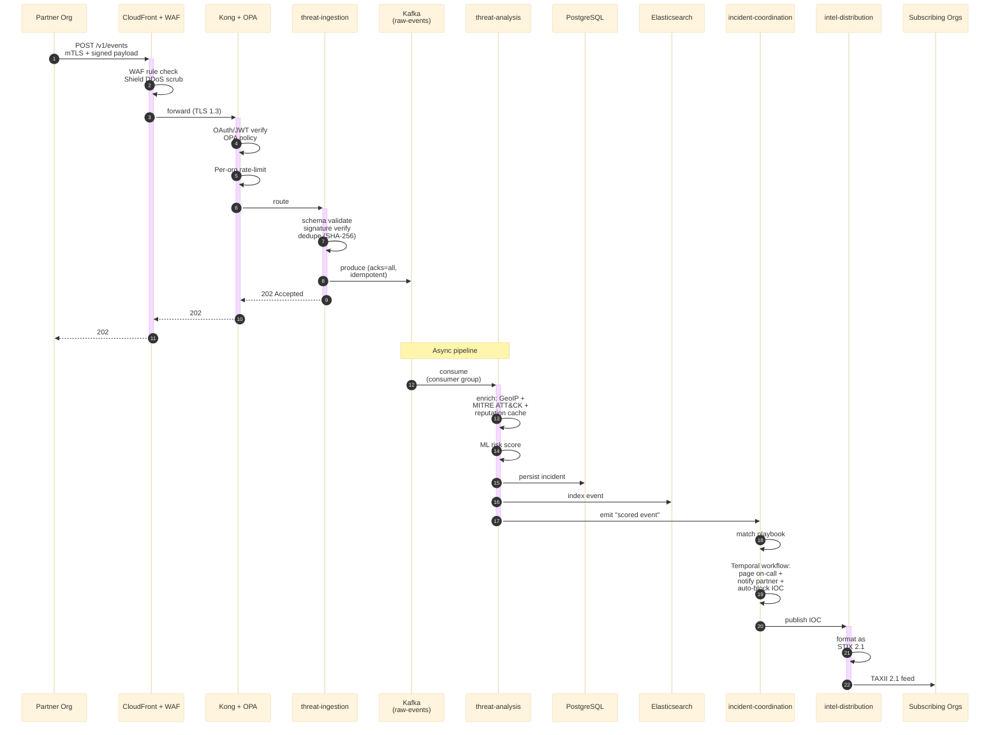

# Data Flow — Ingestion to Distribution

## Why this shape

- **Synchronous boundary stops at Kong** → ingestion stays low-latency even under load
- **Kafka is the durability boundary** → if downstream is broken, events are replayable
- **Temporal handles long-running incidents** → retries, timers, human approvals all checkpointed
- **STIX/TAXII is the industry-standard feed format** → partners integrate with off-the-shelf tooling
