# CI/CD Pipeline — Jenkins on Kubernetes

```mermaid
%%{init: {'theme':'base','themeVariables':{'fontSize':'13px'}}}%%
flowchart LR
    classDef ok fill:#065f46,stroke:#10b981,color:#fff
    classDef sec fill:#7f1d1d,stroke:#ef4444,color:#fff
    classDef gate fill:#78350f,stroke:#f59e0b,color:#fff
    classDef deploy fill:#1e3a8a,stroke:#3b82f6,color:#fff

    DEV([Developer<br/>git push])
    HOOK[Jenkins<br/>webhook]
    POD[Ephemeral<br/>K8s agent pod]
    LINT[Lint +<br/>SAST semgrep +<br/>gitleaks]:::sec
    UT[Unit tests<br/>+ coverage ≥ 80%]:::ok
    BUILD[Kaniko<br/>image build]:::ok
    SCAN[Trivy scan<br/>fail on HIGH/CRIT]:::sec
    SIGN[cosign sign<br/>key from Vault]:::sec
    PUSH[ECR push]
    STAGE[kustomize apply<br/>→ staging]:::deploy
    SMOKE[Smoke test]:::ok
    APPR{{Manual approval<br/>SRE + Platform lead}}:::gate
    CANARY[Argo Rollouts<br/>10% → 50% → 100%]:::deploy
    SLO{{SLO burn-rate<br/>guard}}:::gate
    AUDIT[(Immutable<br/>audit S3)]:::sec

    DEV --> HOOK --> POD
    POD --> LINT --> UT --> BUILD --> SCAN --> SIGN --> PUSH --> STAGE --> SMOKE --> APPR --> CANARY --> SLO
    CANARY -.->|breach| ROLLBACK([Auto rollback])
    SLO --> AUDIT
    SIGN -.->|signature| AUDIT
```

## Three independent gates against bad releases

| Gate | What it catches |
|---|---|
| **Trivy scan** | Vulnerable base image or library |
| **cosign signature + Kyverno admission** | Unsigned/tampered image — cluster refuses to admit it |
| **Argo Rollouts + SLO burn-rate guard** | Bad release that passes tests but breaks production |

Every step writes an immutable record to the audit S3 bucket (Object Lock COMPLIANCE).
