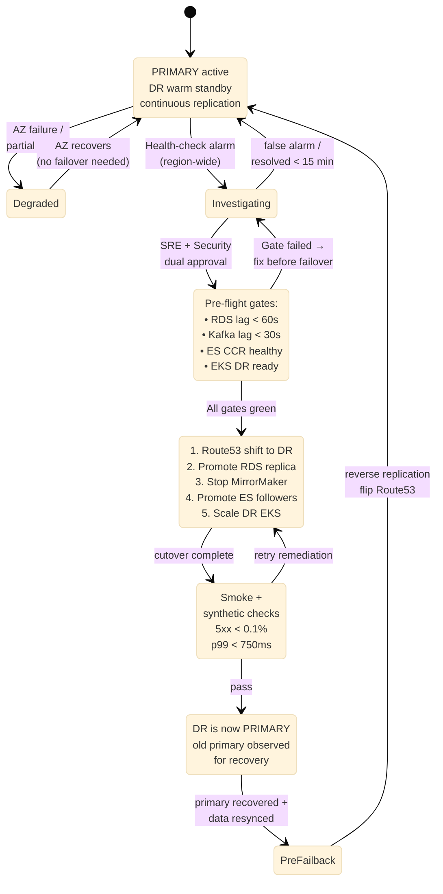

# DR Failover — State Machine

## RTO / RPO Budget

| Phase | Budget | What it covers |
|---|---|---|
| Detect | 5 min | Health-check + alerting |
| Decide | 5 min | SRE + Security dual approval |
| Execute | 15 min | Route53 + RDS promote + scale-up |
| Validate | 5 min | Smoke + synthetic |
| **Total RTO** | **30 min** | end-to-end recovery |
| **RPO** | **≤ 5 min** | replication lag bound |
