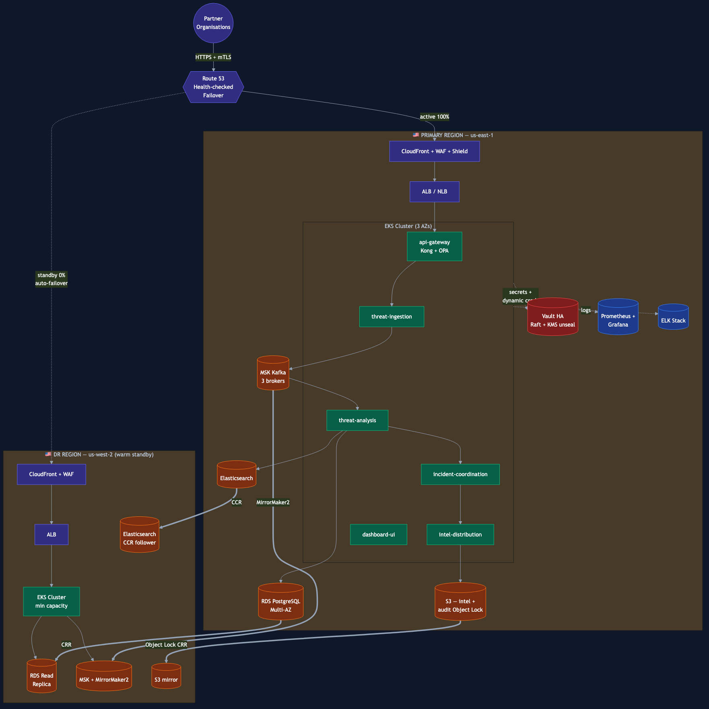

<!-- _class: invert lead -->

# Project SentinelGrid
## A Cloud-Native DevOps Ecosystem for National Cyber Defense

**Case Study 94 — DevOps Implementation**

Multi-region · Highly resilient · Fully automated

---

## 1 · The Problem

SentinelGrid Cyber Defense Agency protects **six categories of critical national infrastructure**:

energy · transport · finance · healthcare · telecoms · government

The platform must:

- ingest **billions of security events daily** — no losses
- correlate threats and **distribute actionable intelligence** to partners
- survive **coordinated attacks, regional outages, ransomware, insiders**
- prove all of the above **to government auditors**

Existing gaps: complex deployments · scalability ceilings · monitoring blind spots · weak DR.

---

## 2 · Solution at a Glance

| Layer | Tool | Why |
|---|---|---|
| IaC | **Terraform** | Multi-region, declarative, drift-detected |
| Containers | **Docker** (distroless, multi-stage) | Minimal attack surface |
| Orchestration | **Kubernetes (EKS)** | 3 node groups, autoscaled, multi-AZ |
| CI/CD | **Jenkins** on K8s agents | Sovereign control of pipeline |
| Monitoring | **Prometheus + Grafana** | SLO burn-rate alerting |
| Logging | **ELK + Filebeat** | Enriched (GeoIP, MITRE ATT&CK) |
| Secrets | **Vault HA** (Raft + KMS unseal) | Dynamic creds, mTLS PKI |
| DR | Multi-region + Velero + S3 Object Lock | **RPO 5 min / RTO 30 min** |

---

## 3 · Architecture — Two Regions, One Platform



**Primary** (us-east-1)
all traffic · full capacity

**DR** (us-west-2)
warm standby · continuous replication

**Replication**
- RDS cross-region replica
- MSK MirrorMaker 2
- Elasticsearch CCR
- S3 Object Lock CRR

**Failover**
Route 53 health checks
30-min RTO

---

## 4 · The SentinelGrid Platform (six microservices)

| Service | Job | Stack |
|---|---|---|
| `threat-ingestion` | Ingest signed events from partners | Python · FastAPI · Kafka |
| `threat-analysis` | Correlate, enrich, score | Python · Spark Streaming |
| `intel-distribution` | Publish STIX/TAXII feeds | Go |
| `incident-coordination` | Playbook workflows | Node.js · Temporal |
| `api-gateway` | AuthN/Z, rate-limit | Kong + OPA |
| `dashboard-ui` | SOC operator console | React + TypeScript |

All packaged as **distroless, multi-stage Docker images**, signed with **cosign**.

---

## 5 · Data Flow

```
Partner → CloudFront/WAF → Kong+OPA → threat-ingestion
            → Kafka (raw-events) → threat-analysis
            → PostgreSQL + Elasticsearch + incident-coordination
            → intel-distribution → TAXII feed → Subscribing orgs
```

Why this shape:

- **Synchronous boundary stops at Kong** — keeps ingest latency predictable
- **Kafka is the durability boundary** — events are replayable
- **Temporal handles long-running incidents** — retries + checkpoints survive crashes
- **STIX/TAXII is the industry standard** — partners plug in off-the-shelf tooling

---

## 6 · Infrastructure as Code — Terraform

```
terraform/
├── global/          ← S3+DynamoDB remote state
├── modules/
│   ├── vpc/         ← 3-AZ, NAT per AZ, VPC endpoints, Flow Logs
│   ├── eks/         ← KMS-encrypted, IRSA, 3 node groups
│   ├── rds/         ← Multi-AZ, PITR 35 d, IAM auth
│   ├── msk/         ← Kafka, IAM auth, in-transit + at-rest TLS
│   └── s3/          ← intel + audit (Object Lock) + Velero
└── environments/
    ├── prod-primary/   us-east-1
    └── prod-dr/        us-west-2
```

Day-2: changes via PR · Atlantis posts plan · drift detection runs hourly.

---

## 7 · CI/CD Pipeline (Jenkins)

```
git push → Jenkins → ephemeral K8s agent pod

  1. Lint + SAST (semgrep, gitleaks)
  2. Unit tests + coverage ≥ 80%
  3. Build (Kaniko — no Docker daemon)
  4. Scan (Trivy — fail HIGH/CRITICAL)
  5. Sign (cosign, key from Vault)
  6. Push to ECR
  7. Deploy → staging (kustomize)
  8. Smoke test
  9. Manual approval gate
 10. Argo Rollouts canary 10 → 50 → 100%
 11. SLO burn-rate guard → auto rollback
 12. Immutable audit → S3 Object Lock
```

**Three independent gates** protect production: Trivy, cosign+Kyverno, SLO guard.

---

## 8 · Monitoring & Observability

| Pillar | Stack |
|---|---|
| **Metrics** | Prometheus + Grafana + Alertmanager → PagerDuty/Slack |
| **Logs** | Filebeat → Logstash (enrich GeoIP + MITRE) → Elasticsearch (ILM hot/warm/cold) → Kibana |
| **Traces** | OpenTelemetry → Tempo |

**SLO burn-rate alerting** (Google SRE multi-window):

- 14.4× over 1 h → page
- 6× over 6 h → ticket

**Every alert has a runbook** linked in its annotation — enforced by a CI lint check.

---

## 9 · Security & Secrets — Vault

**Vault HA (3-node Raft, KMS auto-unseal)** as the single source of trust:

- Kubernetes auth — pods authenticate using their ServiceAccount JWT
- **Dynamic Postgres credentials** — TTL 1 h, max 24 h
- **PKI engine** — short-lived mTLS certs for service-to-service
- Transit engine — envelope encryption for data at rest
- Audit log → stdout → Filebeat → **immutable S3 audit bucket**

**Defense in depth**:
- IRSA for service-to-AWS (no static keys)
- NetworkPolicy deny-by-default per namespace
- Kyverno admission verifies cosign signatures

---

## 10 · Disaster Recovery — RPO 5 min · RTO 30 min

| Mechanism | Coverage |
|---|---|
| RDS Multi-AZ + cross-region read replica | DB durability |
| MSK MirrorMaker 2 + S3 tiered storage | Kafka event durability |
| Elasticsearch CCR | Search index parity |
| **Velero → S3 Object Lock COMPLIANCE** | K8s state, ransomware-proof |
| S3 versioning + CRR | Threat-intel data lake |
| Route 53 health-checked failover | DNS cutover |

**Validation cadence**: monthly restore drill · weekly chaos game-days · semi-annual live failover.

---

## 11 · Final Evaluation Scenarios — How We Win

| Scenario | Primary control | Recovery SLA |
|---|---|---|
| Coordinated DDoS | Shield Adv + WAF + Kong limits + HPA | < 60 s detection |
| Node / AZ failure | PDB + topology spread + Cluster Autoscaler | < 5 min |
| **Regional outage** | **Route 53 failover → DR region** | **RTO 30 min / RPO 5 min** |
| Insider threat | Vault audit + dual-control PR + 1-hr dynamic creds | Forensic trail preserved |
| Ransomware | Object Lock backups + RDS PITR + admission cosign | < 2 hr full restore |
| Communication outage | Kafka durable + idempotent + DLQ + Temporal retries | Zero event loss |

---

## 12 · Deliverables Map

| Case-study requirement | Where in the repo |
|---|---|
| Infrastructure Automation | `terraform/` |
| Containerization | `docker/`, `applications/` |
| Container Orchestration | `kubernetes/` |
| CI/CD | `jenkins/` |
| Monitoring & Observability | `monitoring/` |
| Centralized Logging | `logging/` |
| Security Controls | `vault/` |
| Disaster Recovery | `disaster-recovery/` |
| Documentation | `docs/`, `README.md` |

**52 files · 65 directories · 12-week delivery plan.**

---

<!-- _class: invert lead -->

# Thank you

## Project SentinelGrid

`SEM-4 S-2/SentinelGrid/`

Architecture · Implementation · Operations · Resilience
